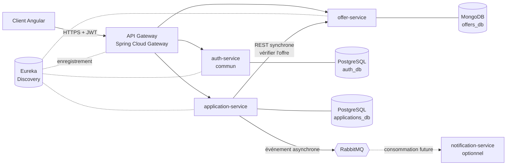

# Diagramme d'architecture globale

```mermaid
flowchart LR
    C[Client Angular] -->|HTTPS + JWT| GW[API Gateway<br/>Spring Cloud Gateway]
    GW --> AUTH[auth-service<br/>commun]
    GW --> OFFER[offer-service]
    GW --> APP[application-service]
    EU[(Eureka<br/>Discovery)] -.enregistrement.- GW
    EU -.- AUTH
    EU -.- OFFER
    EU -.- APP
    AUTH --- DB1[(PostgreSQL<br/>auth_db)]
    OFFER --- DB2[(MongoDB<br/>offers_db)]
    APP --- DB3[(PostgreSQL<br/>applications_db)]
    APP -->|REST synchrone<br/>vérifier l'offre| OFFER
    APP -->|événement asynchrone| MQ{{RabbitMQ}}
    MQ -.->|consommation future| NOTIF[notification-service<br/>optionnel]
```
