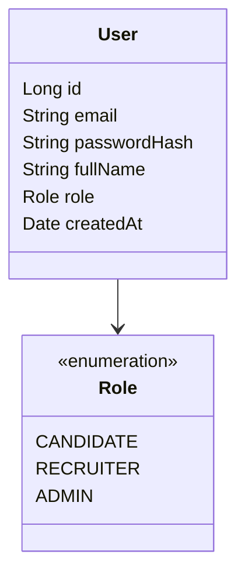
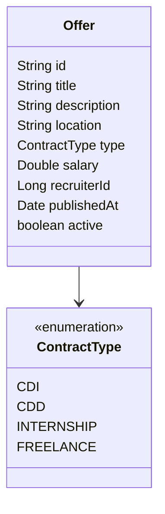
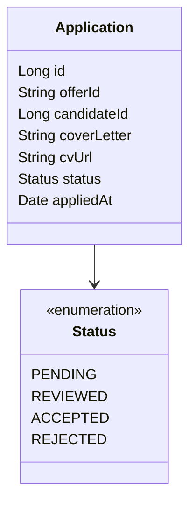

# Diagrammes de classes

## auth-service

```mermaid
classDiagram
    class User {
        Long id
        String email
        String passwordHash
        String fullName
        Role role
        Date createdAt
    }
    class Role {
        <<enumeration>>
        CANDIDATE
        RECRUITER
        ADMIN
    }
    User --> Role
```

## offer-service

```mermaid
classDiagram
    class Offer {
        String id
        String title
        String description
        String location
        ContractType type
        Double salary
        Long recruiterId
        Date publishedAt
        boolean active
    }
    class ContractType {
        <<enumeration>>
        CDI
        CDD
        INTERNSHIP
        FREELANCE
    }
    Offer --> ContractType
```

## application-service

```mermaid
classDiagram
    class Application {
        Long id
        String offerId
        Long candidateId
        String coverLetter
        String cvUrl
        Status status
        Date appliedAt
    }
    class Status {
        <<enumeration>>
        PENDING
        REVIEWED
        ACCEPTED
        REJECTED
    }
    Application --> Status
```
