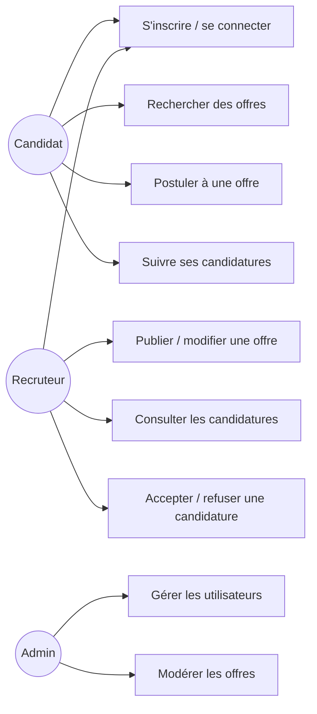

# Acteurs et cas d'utilisation

```mermaid
flowchart LR
    Cand((Candidat)) --> U1[S'inscrire / se connecter]
    Cand --> U2[Rechercher des offres]
    Cand --> U3[Postuler à une offre]
    Cand --> U4[Suivre ses candidatures]
    Rec((Recruteur)) --> U1
    Rec --> U5[Publier / modifier une offre]
    Rec --> U6[Consulter les candidatures]
    Rec --> U7[Accepter / refuser une candidature]
    Adm((Admin)) --> U8[Gérer les utilisateurs]
    Adm --> U9[Modérer les offres]
```
